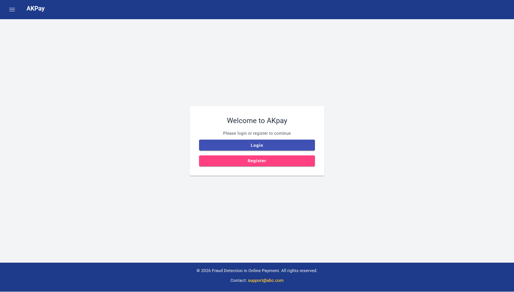
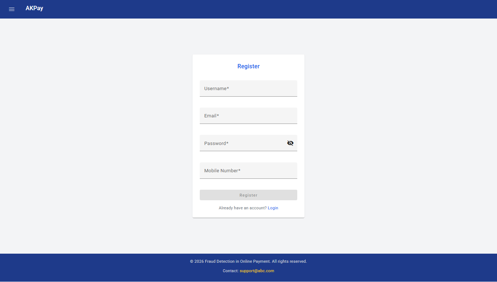
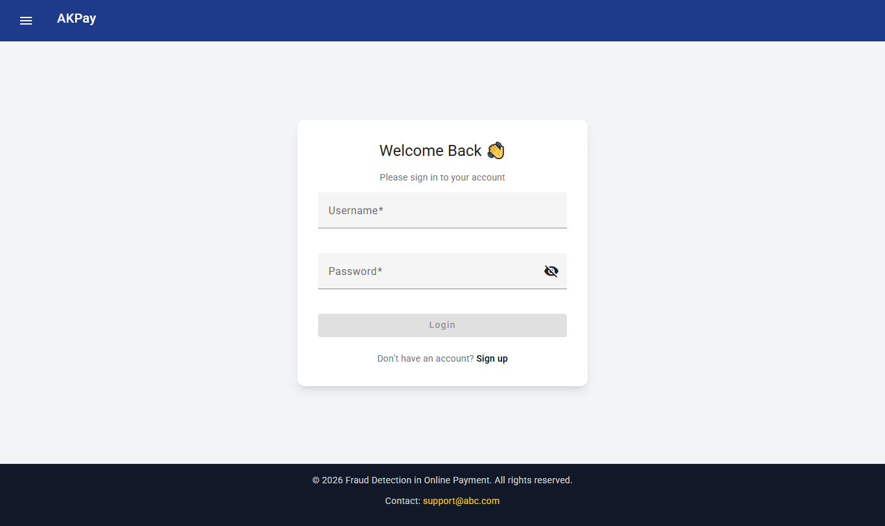
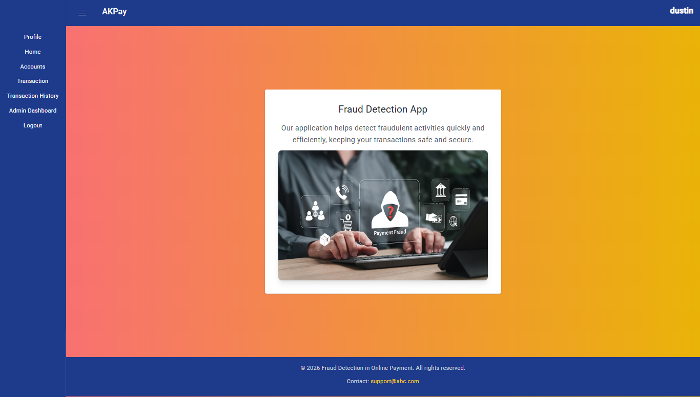
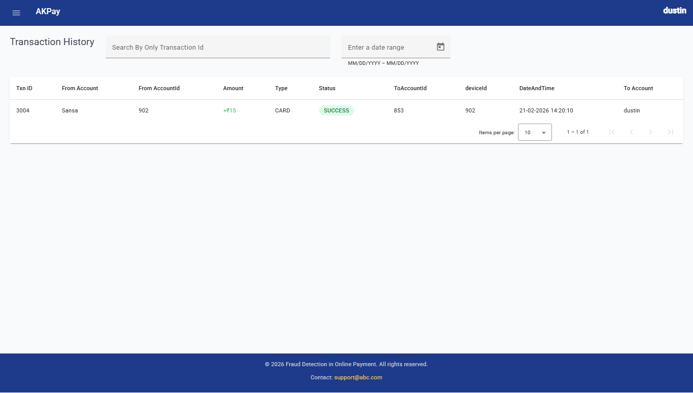
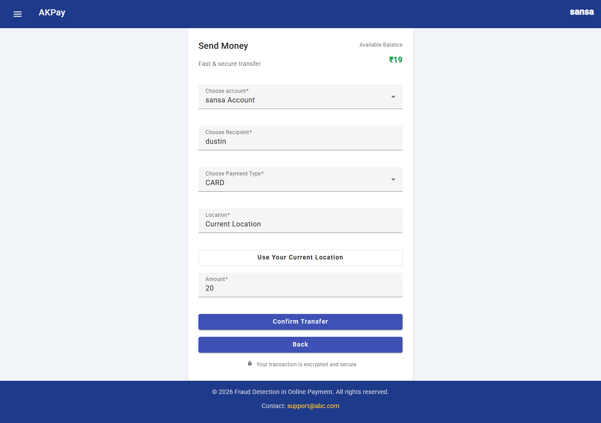
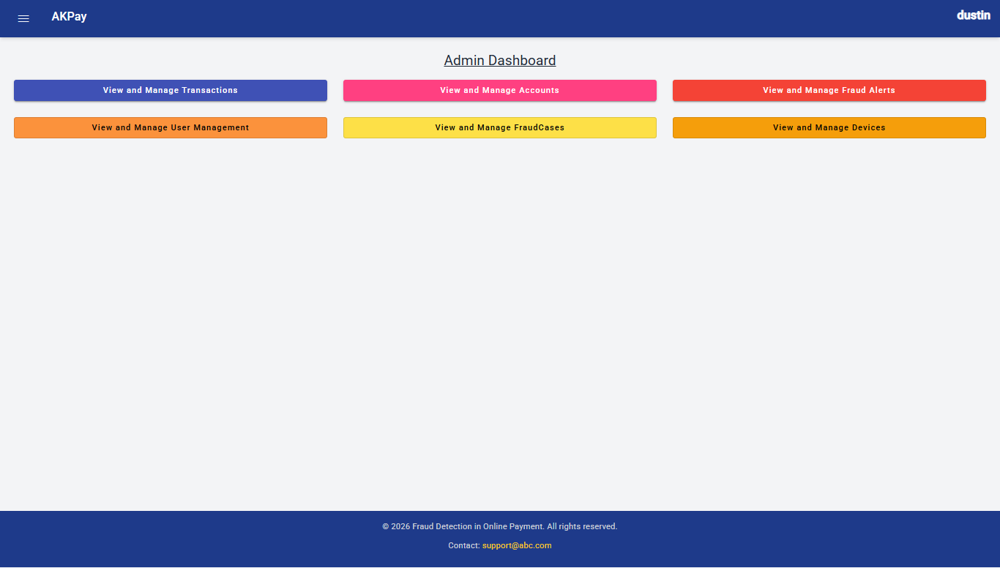
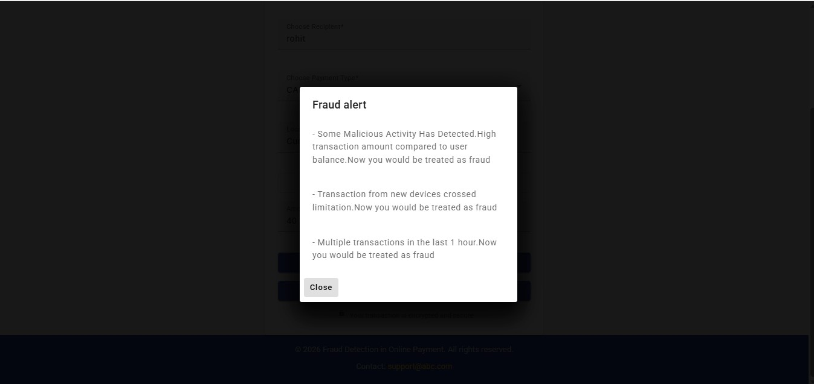
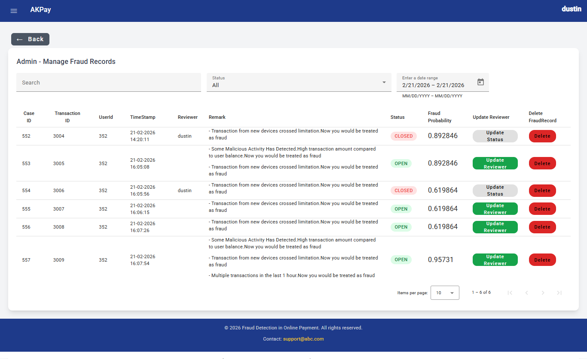

<h1>Fraud Detection in Online Payment System</h1>
<h2>Overview</h2>
Online transactions have become an essential part of the modern economy, but fraudulent
activities are increasing rapidly. This project aims to detect online payment frauds in
real-time using microservices architecture and Apache Kafka. The backend is developed with
Spring Boot (in Eclipse), the Machine Learning model is built using Python, and the frontend
is designed using Angular. The system ensures modularity, scalability, and quick response to
suspicious transactions.
<h1>Technology Stack</h1>

<h2>Frontend</h2>

<ul>
 <li><Strong>Angular 17 : </Strong><ul><li>Frontend framework</li></ul></li>

<li><Strong>Angular Material :  </Strong><ul><li> UI components.</li></ul></li>

<li><Strong>Tailwind CSS : </Strong><ul><li> Responsive and modern styling.</li></ul></li>

<li><Strong>HTTP Interceptor : </Strong><ul><li> Attaches JWT token to HTTP requests.</li></ul></li>

<li><Strong>Reactive Forms Module :</Strong><ul><li> Form validation and handling.</li></ul></li>

<li><Strong>TokenExpired-Gaurd : </Strong><ul><li> Token get expired then logout the user.</li></ul></li>

<li><Strong>AdminGaurd : </Strong><ul><li> Prevents Admin Pages From Users.</li></ul></li>

</ul>

<h2>Backend</h2>

<ul>
<li><Strong>Spring Boot 3.2.5 (Java 17) : </Strong><ul><li> Backend REST API development.</li></ul></li>

<li><Strong>Spring Data JPA (Hibernate) : </Strong><ul><li> ORM for database communication.</li></ul></li>

<li><Strong>MySQL : </Strong><ul><li> Stores user/Admin,Alerts,Transaction,AccountDetail,FraudAlertsRecords,Devices.</li></ul></li>

<li><Strong>Apache Kafka(3.9.4) : </Strong><ul><li> For the communication between the microservices.</li></ul></li>

<li><Strong>Microservices Architecture : </Strong><ul><li>Includes ApiGateway,ServiceRegistry,config-server.</li></ul></li>

<li><Strong>Python Jupyter : </Strong><ul><li> Used to train the model using randomForest Algorithm.</li></ul></li>

<li><Strong>Fast Api : </Strong><ul><li> Used for Prediction and Send Response to the MLService(MicroService).</li></ul></li>

<li><Strong>Features : </Strong><ul><li> amount_ratio,transaction_count(within lasthour),devices_count.</li></ul></li>

<li><Strong>WebSocket : </Strong><ul><li> Used for RealTime Alert while Transacation is being happened.</li></ul></li>

</ul>

<h2>Security</h2>

<ul>
<li><Strong>Spring Security : </Strong><ul><li> Authentication and authorization</li></ul></li>

<li><Strong>JWT (JSON Web Token) : </Strong><ul><li> Token-based authentication</li></ul></li>

<li><Strong>BCrypt : </Strong><ul><li> Password encryption for secure login</li></ul></li>

<li><Strong>isLogged-Gaurd (Frontend) : </Strong><ul><li> Prevents unauthorized access</li></ul></li>
</ul>

<h2>Screenshots</h2>

<table>
<tr>
  <td style="border: 1px solid; padding:10px;" align="center">
    
    
<b>StartPage</b>

  </td>
  <td style="border: 1px solid; padding:10px;" align="center">
     
    
<b>RegisterPage</b>

  </td>
  <td style="border: 1px solid; padding:10px;" align="center">
     
    
<b>LoginPage</b>

  </td>
</tr>
<tr>
  <td style="border: 1px solid; padding:10px;" align="center">
    
    
<b>Homepage</b>

  </td>
  <td style="border: 1px solid; padding:10px;" align="center">
     
    
<b>TransactionHistory</b>

  </td>
  <td style="border: 1px solid; padding:10px;" align="center">
     
    
<b>TransactionPage</b>

  </td>
</tr>
<tr>
  <td style="border: 1px solid; padding:10px; " align="center">
    
    
<b>AdminDashBoard</b>

  </td>
  <td style="border: 1px solid; padding:10px;" align="center">
     
    
<b>AlertPage</b>

  </td>
  <td style="border: 1px solid; padding:10px;" align="center">
     
    
<b>AdminFraudRecords Page</b>

  </td>
</tr>
</table>
